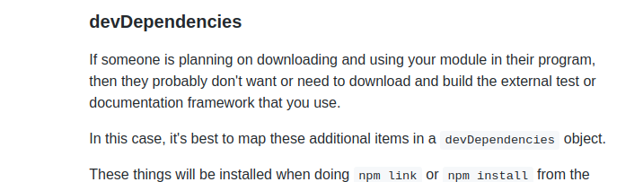

## dependencies 和 devDependencies

#### Are you kidding me

网上搜索了很多解释，有很多说法是，`dependencies`是生产环境所需要的包，而`devDependencies`是开发环境所需要的包，很多朋友看后就觉得，那么 build 时，`devDependencies`中的包就不会被打包进生产环境产物。我想说的是，打包进哪些依赖是由你的打包器，像`webpack`等工具决定，跟`npm`没啥关系。

#### 事实是

正确解释是，我们新建一个项目，然后`npm init`生成一个`package.json`，可以看作是开发一个 module，那么我们开发的模块将来可能是会发布到`npm`仓库供别人使用，也可能只是自己使用不会发布。那么如果是会发布到`npm`上，当别人`npm install`安装你的包时，就还会安装你的模块中`package.json`中`dependencies`依赖的包，而`devDependencies`中的依赖，你的包使用者就不会安装。请看来自`npm`官网对`devDependencies`的解释：

::: tip
总的来说，开发时，像公司一般非公共模块项目，并不会发布供其它人引用，那么实际上，你将依赖写在`dependencies`和`devDependencies`中并没有太大区别。(另外在`npm install`时加入--production 有区别，此时也不会下载`devDependencies`的依赖。前提是保证这里边的依赖不影响项目打包部署，也只有 eslint、prettier 这种才是完全不影响的了）
:::

#### 应该怎么做

对于自己要发布上线的项目，`eslint`、`prettier`以及`ts的type`等等这些发布完全用不到的可以放到`devDependencies`下，然后上线打包部署的时候可以用`npm install --production`可以减少一些依赖安装时间；如果是要发布到 npm 仓库的第三方模块，不影响本模块功能的都可以放到`devDependencies`下，这样别人在引用的模块时也不会安装这些模块，减少冲突。例如这时候被引入模块的`webpack`、`babel`依赖这时候对于引入方可能就不是必须的。

## package.json 和 package.lock.json

[文章参考](https://juejin.cn/post/7078233610683170824)。

#### 版本号

版本号由三部分组成：major.minor.patch，主版本号.次版本号.修补版本号。

#### 安装依赖包版本

`~` 会匹配最近的小版本依赖包，比如 ~1.2.3 会匹配所有 1.2.x 版本，但是不包括 1.3.0。  
`^` 会匹配最新的大版本依赖包，比如 ^1.2.3 会匹配所有 1.x.x 的包，包括 1.3.0，但是不包括 2.0.0。  
 `*` 安装最新版本的依赖包，比如 \*1.2.3 会匹配 x.x.x，

如果完全希望项目依赖包版本固定，可以将所有依赖版本都写死，如 x.x.x。但及时这样，也无法固定依赖包中所依赖的包的版本，所以此时就需要`package.lock.json`来对整个依赖树进行版本固定的（锁死）

当我们在一个项目中`npm install`时候，会自动生成一个`package-lock.json`文件，和`package.json`在同一级目录下。`package-lock.json`记录了项目的一些信息和所依赖的模块。这样在每次安装都会出现相同的结果. 不管你在什么机器上面或什么时候安装。
当我们下次再`npm install`时候，npm 发现如果项目中有`package-lock.json`文件，会根据`package-lock.json`里的内容来处理和安装依赖而不再根据`package.json`。
